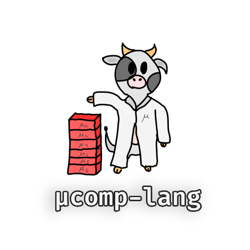

<center>
    
</center>

## μcomp-lang

μcomp-lang is a didactic language implemented for *Language, Compilers and Iterpreters* course at **UniPi**.

### Example

The snippet below shows a simple program written in μcomp.

```

component EntryPoint provides App {

    def main() : int {

        var foo : int;
        var bar : int;

        foo = 25;
        bar = 42;

        return foo + bar;
    }
}

```